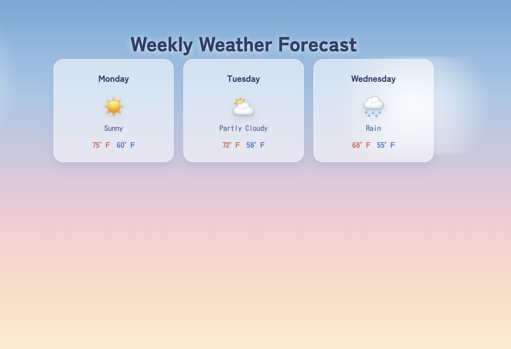

# 🌤️ JSON Playground — Weekly Weather Forecast

A Laravel exercise that reads a static JSON file, decodes it in a controller, and displays the data in a styled Blade view.

## 📖 Overview

This project simulates consuming an API response by:
1. 📦 Storing static weather data in `storage/app/private/weather.json`
2. 🔍 Reading and decoding it in `WeatherController@index` using `Storage::json()`
3. 🔗 Passing the decoded array to a Blade view
4. 🎨 Rendering it as a styled, anime-inspired weather forecast page

## 🛠️ Tech Stack

- 🅿️ Laravel 13
- 🐘 PHP 8.4
- 🔥 Blade templating

## 📁 Key Files

- `app/Http/Controllers/WeatherController.php` — reads and decodes the JSON file
- `resources/views/weather/index.blade.php` — displays the forecast
- `storage/app/private/weather.json` — static weather data
- `routes/web.php` — defines the `/weather` route

## 🚀 Running Locally

```bash
composer install
cp .env.example .env
php artisan key:generate
php artisan serve
```

Then visit `http://127.0.0.1:8000/weather` ☀️

## 📸 Screenshot

